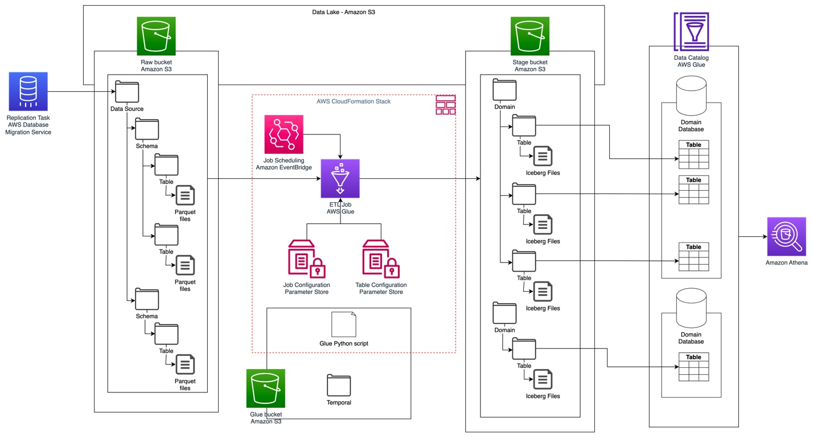

## Automate replication of relational sources into a transactional data lake with Apache Iceberg and AWS Glue

Organizations have chosen to build data lakes on top of Amazon Simple Storage Service (Amazon S3) for many years. A data lake is the most popular choice for organizations to store all their organizational data generated by different teams, across business domains, from all different formats, and even over history. According to a study, the average company is seeing the volume of their data growing at a rate that exceeds 50% per year, usually managing an average of 33 unique data sources for analysis.

Teams often try to replicate thousands of jobs from relational databases with the same extract, transform, and load (ETL) pattern. There is lot of effort in maintaining the job states and scheduling these individual jobs. This approach helps the teams add tables with few changes and also maintains the job status with minimum effort. This can lead to a huge improvement in the development timeline and tracking the jobs with ease.

In this post, we show you how to easily replicate all your relational data stores into a transactional data lake in an automated fashion with a single ETL job using Apache Iceberg and AWS Glue.

### Solution architecture
Data lakes are usually organized using separate S3 buckets for three layers of data: the raw layer containing data in its original form, the stage layer containing intermediate processed data optimized for consumption, and the analytics layer containing aggregated data for specific use cases. In the raw layer, tables usually are organized based on their data sources, whereas tables in the stage layer are organized based on the business domains they belong to.

This SAM template that deploys an AWS Lambda that reads an Amazon S3 path for one data source of the data lake raw layer, and ingests the data into Apache Iceberg tables on the stage layer using AWS Glue support for data lake frameworks. The function expects tables in the raw layer to be structured in the same way as they are ingested: schema, then table, then data files.

This solution uses AWS Systems Manager Parameter Store for table configuration. You should modify this parameter specifying the tables you want to process and how, including information such as primary key, partitions, and the business domain associated. The job uses this information to automatically create a database (if it doesn’t already exist) for every business domain, create the Iceberg tables, and perform the data loading.

### Primitive Types

| Added by version | Primitive type                | Description                                             | Requirements                          |
|------------------|-------------------------------|---------------------------------------------------------|---------------------------------------|
| boolean          | True or false                 |                                                         |                                       |
| int              | 32-bit signed integers        |                                                         | Can promote to long                   |
| long             | 64-bit signed integers        |                                                         |                                       |
| float            | 32-bit IEEE 754 floating point|                                                         | Can promote to double                 |
| double           | 64-bit IEEE 754 floating point|                                                         |                                       |
| decimal(P,S)     | Fixed-point decimal; precision P, scale S | Scale is fixed, precision must be 38 or less           |                                       |
| date             | Calendar date without timezone or time |                                                |                                       |
| time             | Time of day, microsecond precision, without date, timezone |                        |                                       |
| timestamp        | Timestamp, microsecond precision, without timezone | [1]                          |                                       |
| timestamptz      | Timestamp, microsecond precision, with timezone | [2]                          |                                       |
| v3               | timestamp_ns                  | Timestamp, nanosecond precision, without timezone       | [1]                                   |
| v3               | timestamptz_ns                | Timestamp, nanosecond precision, with timezone          | [2]                                   |
| string           | Arbitrary-length character sequences | Encoded with UTF-8 [3]                                |                                       |
| uuid             | Universally unique identifiers | Should use 16-byte fixed                                |                                       |
| fixed(L)         | Fixed-length byte array of length L |                                                |                                       |
| binary           | Arbitrary-length byte array   |                                                         |                                       |

#### Notes

1. Timestamp values without time zone represent a date and time of day regardless of zone: the time value is independent of zone adjustments (2017-11-16 17:10:34 is always retrieved as 2017-11-16 17:10:34).

2. Timestamp values with time zone represent a point in time: values are stored as UTC and do not retain a source time zone (2017-11-16 17:10:34 PST is stored/retrieved as 2017-11-17 01:10:34 UTC and these values are considered identical).

3. Character strings must be stored as UTF-8 encoded byte arrays.

### The AWS Glue Data Catalog now supports storage optimization of Apache Iceberg tables

*12 SEP 2024*. The **AWS Glue Data Catalog** now enhances managed table optimization of Apache Iceberg tables by automatically removing data files that are no longer needed. Along with the Glue Data Catalog’s automated compaction feature, these storage optimizations can help you reduce metadata overhead, control storage costs, and improve query performance.

Iceberg creates a new version called a snapshot for every change to the data in the table. Iceberg has features like time travel and rollback that allow you to query data lake snapshots or roll back to previous versions. As more table changes are made, more data files are created. In addition, any failures during writing to Iceberg tables will create data files that aren’t referenced in snapshots, also known as orphan files. Time travel features, though useful, may conflict with regulations like GDPR that require permanent data deletion. Because time travel allows accessing data through historical snapshots, additional safeguards are needed to maintain compliance with data privacy laws. To control storage costs and comply with regulations, many organizations have created custom data pipelines that periodically expire snapshots in a table that are no longer needed and remove orphan files. However, building these custom pipelines is time-consuming and expensive.

### Reference

* [[AWS Big Data Blog] - The AWS Glue Data Catalog now supports storage optimization of Apache Iceberg tables](https://aws.amazon.com/blogs/big-data/the-aws-glue-data-catalog-now-supports-storage-optimization-of-apache-iceberg-tables/)

* [Primitives types - Apache Iceberg](https://iceberg.apache.org/spec/#primitive-types)

* [Iceberg data types](https://docs.cloudera.com/cdw-runtime/cloud/iceberg-how-to/topics/iceberg-data-types.html)

* [[AWS Docs] - Supported data types for Iceberg tables in Athena](https://docs.aws.amazon.com/athena/latest/ug/querying-iceberg-supported-data-types.html)